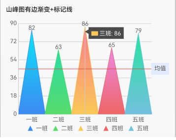
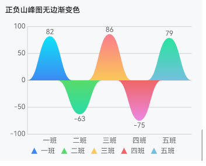
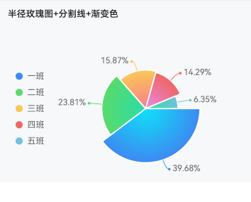

# UCharts for Harmony - 鸿蒙可视化图表库

## 项目简介

UCharts 是一款高性能、易用的图表库，现已适配 HarmonyOS 平台。支持多种常用图表类型，满足鸿蒙应用的数据可视化需求。

## 特性

- 🧩 **模块化设计**：底层渲染与平台适配解耦，易于扩展和维护
- 🛡️ **TypeScript 全面支持**：类型安全，开发体验优秀
- 🎨 **丰富图表类型**：柱状图、条状图、折线图、区域图、山峰图等
- ⚡ **高性能渲染**：底层优化，动画流畅
- 🔌 **易于扩展**：支持自定义图表类型和平台适配
- 🍭 **自定义样式**：支持主题定制

## 支持的图表类型

- **柱状图 (column)**
- **条状图 (bar)**
- **折线图 (line)**
- **区域图 (area)**
- **山峰图 (mount)**
- **散点图 (scatter)**
- **气泡图 (bubble)**
- **混合图 (mix)**
- **饼状图 (pie)**
- **环形图 (ring)**
- **玫瑰图 (rose)**
- **更多类型持续开发中...**

## 图表示例

以下为部分图表类型的鸿蒙平台实际渲染效果：

- 柱状图
  
   

- 区域图
  
   

- 山峰图
  
   

- 散点图
  
  

- 气泡图
  
  

- 饼图
  
  

- 玫瑰图
  
  

（更多类型和样式可参考 example 目录）

## 下载安装

```ts
ohpm install @ibestservices/ucharts
```

OpenHarmony ohpm 环境配置等更多内容，请参考[如何安装 OpenHarmony ohpm 包](https://gitee.com/openharmony-tpc/docs/blob/master/OpenHarmony_har_usage.md)

## 快速开始

```typescript
// 鸿蒙版
import { ChartOptions, UCharts, UChartsController } from '@ibestservices/ucharts'

@Entry
@Component
struct Index {
  @State chart: UChartsController = new UChartsController();
  private opts: Partial<ChartOptions> = {
    type: "column",
    categories: ["2018","2019","2020","2021","2022","2023"],
    series: [
      {
        name: "目标值",
        data: [35,36,31,33,13,34]
      },
      {
        name: "完成量",
        data: [18,27,21,24,6,28]
      }
    ],
    padding: [15,15,0,5],
    xAxis: {
      disableGrid: true
    },
    yAxis: {
      data: [{min: 0}]
    },
    extra: {
      column: {
        type: "group",
        width: 30,
        activeBgColor: "#000000",
        activeBgOpacity: 0.08
      }
    }
  }

  build() {
    Column(){
      UCharts({ controller: this.chart, onReady: () => {
          this.chart.updateData(this.opts)
      }})
      /*
       * 或者初始化时传入默认配置
       * @State chart: UChartsController = new UChartsController(this.opts);
       * UCharts({ controller: this.chart })
       * */
    }
    .height('100%')
    .width('100%')
  }
}
```

## API 文档

详见[文档](https://github.com/junbin-yang/uCharts-v3/tree/master/docs)目录。

## 适配说明

- 本库专为 HarmonyOS 平台适配，充分利用鸿蒙 Canvas 绘图能力。
- 如需自定义扩展，可参考 adapters/platform/harmony 目录下的适配代码。

## 链接
- [Github](https://github.com/junbin-yang/uCharts-v3)
- [Gitee](https://gitee.com/uCharts/uCharts-v3)

## 问题反馈

如在使用过程中遇到问题，欢迎通过 GitHub Issues 反馈，或加入官方交流群获取支持。

## 许可证

本项目采用 **Apache License 2.0** 开源协议。

- 允许自由使用、修改、分发和商业应用
- 需保留原始版权声明和许可证文件
- 详细条款请见根目录 LICENSE 文件

## 致谢

感谢所有开源贡献者和用户的支持！

